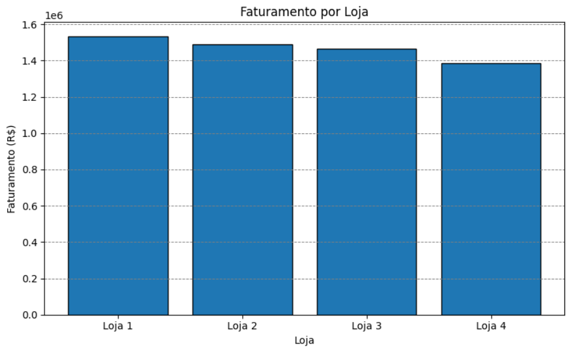
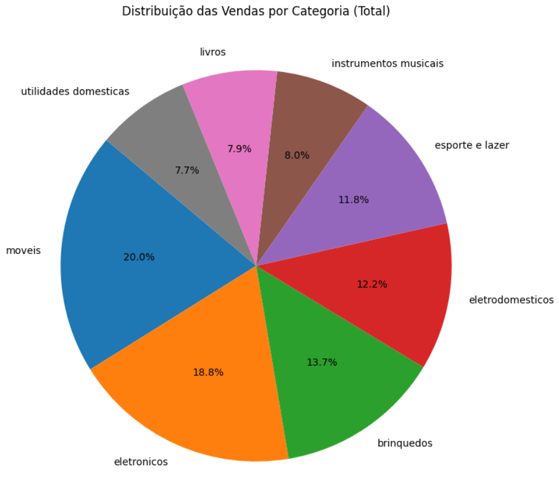
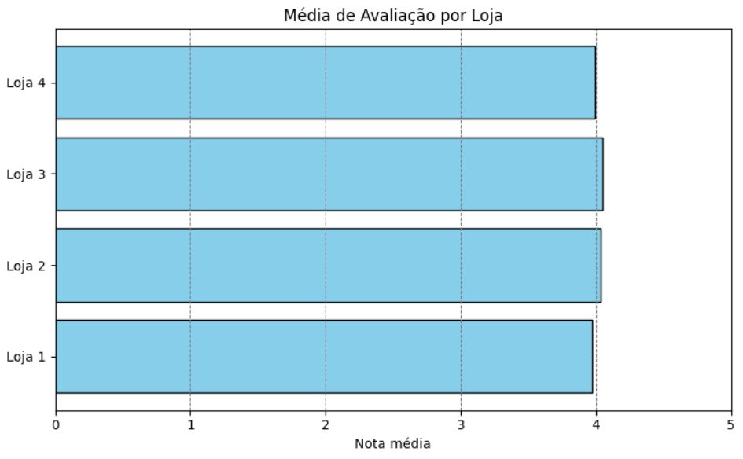

# Challenges Data Science

## Alura & ONE

## 📊 Challenge 1 - Alura Store

## 📊 1º Desafio

**Descrição:** Este desafio, consiste em ajudar o Senhor João a decidir qual loja da sua rede Alura Store vender para iniciar um novo empreendimento. Para isso, deverá ser analisado os dados de vendas, desempenho e avaliações das 4 lojas fictícias da Alura Store.

🛍️ **O objetivo é identificar a loja com menor eficiência e apresentar uma recomendação final baseada nos dados.**

**O que será praticado neste desafio:**

✔️ Carregar e manipular dados CSV com a biblioteca Pandas .

✔️ Criar visualizações de dados com biblioteca Matplotlib.

✔️ Analisar métricas como faturamento, avaliações e desempenho de vendas.

### Requisitos:

**1º Analisar os dados das lojas:**

- Avaliar informações como faturamento, categorias mais vendidas, avaliações dos clientes, produtos mais vendidos e frete médio.

**2º Criar gráficos para visualização:**

- Decidir quais tipos de gráficos usar para apresentar os resultados de maneira clara e visual.

- Mínimo de 3 gráficos diferentes, que podem incluir gráficos de barras, pizza, dispersão, entre outros.

**3º Apresentar uma recomendação:**

- Após as análises, escrever um texto explicando qual loja o Senhor João deve vender e por quê, com base nos dados apresentados.

## 🔍 Gráficos

### Primeiro Desafio

